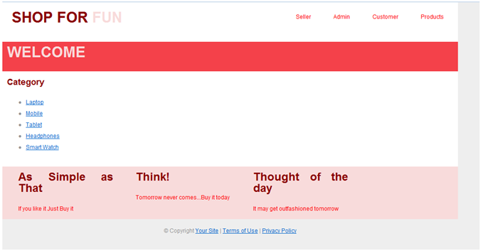
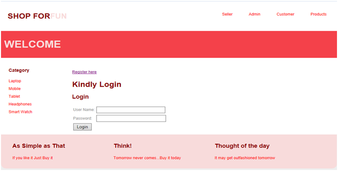
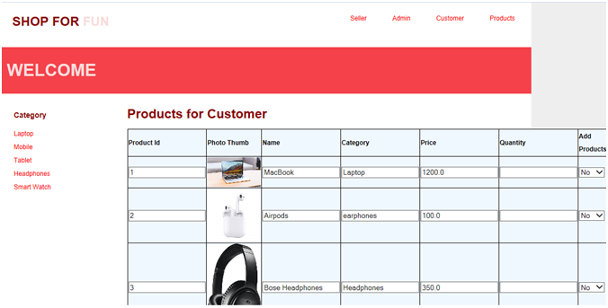
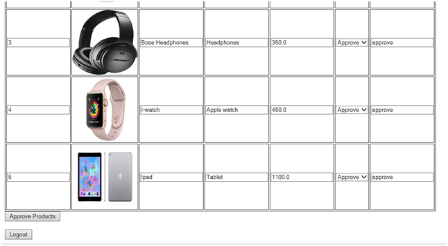
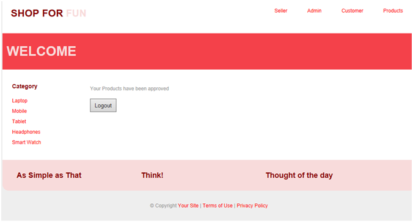

# Electronics-Website 
This is an ecommerce web application which allows user to add and buy electronic products. In this application, a seller or vendor can also register his product by sending his request to admin who can approve or deny his request. Once the request is approved this product gets visible to all the customers and they can add this to their cart and buy. Once the user checks out an order a pdf view of his order is generated

# Web Technologies and Tools used: 
=> STS as IDE  
=> Spring MVC framework  
=> Hibernate ORM for database interaction 
=> JSP to display web pages 
=> HTML, CSS and Javascript for designing 

# Steps to run the application
=> Download an IDE eclipse or STS(Spring Tool Suite). I have used STS here since it has his own server (Pivotal tc server) 
=> You can also download Tomcat 9.0 
=> Clone the repository or download and extract the zip file 
=> Open STS and click on open projects to browse and open the project  
=> You can change your database details accordingly by eiditng hibernate.cfg.xml 
=> Once you run the application the database will be automatically created with all the tables and the column 

# Screenshots of the Application

 

 

 

 

 

